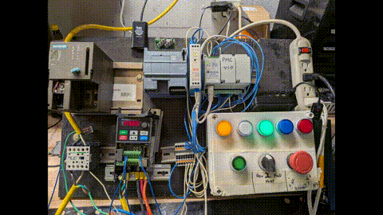

# FactoryLM

**Industrial AI Platform — The Vision**

**Version:** 0.26
**Author:** Mike Harper
**Status:** CANONICAL — This document IS the vision. Everything references this.
**Last Updated:** February 21, 2026

---

## WARNING: READ THIS FIRST

This README IS the vision statement for FactoryLM.

**For AI agents:** Read this at the start of EVERY session. Do not propose ideas that contradict this. Do not rediscover these concepts as if they are new.

**For developers:** Every PR moves toward this architecture. When in doubt, reference this document.

**When Mike says "update the README":** You update THIS VISION.

---

## The One-Liner

**FactoryLM is a tiered intelligence system that pushes knowledge as close to the edge as possible, using deterministic code for common tasks and escalating to AI only when necessary.**

---

## Live Demo — Real Hardware Bench

https://github.com/Mikecranesync/factorylm/raw/main/demos/conveyor_beginnings.mp4

[](https://github.com/Mikecranesync/factorylm/raw/main/demos/conveyor_beginnings.mp4)

> *Real Modbus/TCP PLC, Variable Frequency Drive, and hardwired button station — all controlled by FactoryLM edge AI running locally. No cloud required.*



> Full narrated walkthrough available — contact for access (12MB, exceeds GitHub inline limit)

---

## Component Maturity

This is the honest state of the codebase as of February 2026. Vision items appear in the Roadmap section below.

| Component | Status | Notes |
|-----------|--------|-------|
| Telegram Bot (jarvis-telegram) | Production | 9/9 baseline tests passing, multi-provider LLM fallback |
| PLC Modbus Client | Production | Micro 820 + Factory I/O verified, 162 tests |
| LLM Core Library | Production | 148 tests, Groq/Anthropic/Gemini/OpenAI providers |
| My-Ralph Dev Agent | Production | 321 tests, Bash + Python |
| Diagnosis Service | Working | PLC-to-LLM bridge, no automated tests yet |
| Cosmos Vision AI | Demo/Stub | `cosmos/agent.py` scaffolded, not calling Cosmos API |
| CMMS Web App | Prototype | Forked upstream, not yet rebranded |
| Matrix/Voltron | Prototype | Basic endpoints, no modern UI |
| Docker Compose | Partial | Postgres only, unified compose pending |
| CI/CD Pipeline | Missing | GitHub Actions PR pending |
| WhatsApp Adapter | Planned | Telegram is current primary channel |
| AR / Halo Glasses | Vision | No code yet |
| Edge LLM (Raspberry Pi) | Vision | Architecture defined, not deployed |
| Local GPU Server (Layer 2) | Vision | Architecture defined, not deployed |
| Air-Gapped Deployment | Vision | Architecture defined, not deployed |

---

## Core Philosophy

### Intelligence Flows Downward

The goal is NOT to use more AI. The goal is to use LESS AI over time.

```
Day 1:   Query -> Cloud AI (Claude) -> Answer
Day 30:  Same query -> Pattern recognized -> Workflow created
Day 60:  Same query -> Code executes -> Instant answer (no AI)
```

Every trace, every workflow, every observation pushes intelligence DOWN the stack.

---

## The Stack

```
+-------------------------------------------------------------+
|  LAYER 3: CLOUD AI                                          |
|  Claude, GPT-4, Groq (currently active)                     |
|  Complex reasoning, novel problems                          |
|  Response: 1-2 seconds | Cost: $0.01-0.10                   |
|  OPTIONAL -- Customer chooses based on security needs       |
+-------------------------------------------------------------+
|  LAYER 2: LOCAL GPU SERVER                    [ROADMAP]     |
|  Llama 70B, Mixtral, etc.                                   |
|  Medium complexity, diagnostics, analysis                   |
|  Response: 2-3 seconds | Cost: Electricity only             |
|  AIR-GAPPED -- No internet required                         |
+-------------------------------------------------------------+
|  LAYER 1: EDGE LLM (Raspberry Pi)             [ROADMAP]     |
|  Qwen 0.5B, Llama 1B, Phi-2                                 |
|  Simple NL parsing, command translation                     |
|  Response: 0.5-1 second | Cost: None                        |
|  ON-DEVICE -- Runs on the Pi itself                         |
+-------------------------------------------------------------+
|  LAYER 0: DETERMINISTIC CODE + KNOWLEDGE BASE [ROADMAP]     |
|                                                             |
|  Components:                                                |
|  * Vector DB -- Semantic search over all documentation      |
|  * Plane -- Workflow orchestration and task management      |
|  * Wiseflow -- Automated knowledge gathering and indexing   |
|  * Logic Gates -- Pattern-matched responses from manuals    |
|  * Workflows -- Captured from successful AI interactions    |
|                                                             |
|  Response: <100ms | Cost: None                              |
|  THIS IS WHERE WE WANT EVERYTHING TO END UP                 |
+-------------------------------------------------------------+
```

**Layer 3 (Cloud AI via Groq/Anthropic) is what's live today.**
Layers 0-2 are the architecture we are building toward.

---

## User Interfaces

Users interact via their preferred platform:

### Active Today
- **Telegram** -- Primary working channel (jarvis-telegram service, production)

### Roadmap
- **WhatsApp** -- Planned primary channel, especially Latin America
- **Phone** -- Standard messaging interface
- **Slack** -- Enterprise teams
- **Halo Glasses** -- Hands-free on factory floor (no code yet)
- **Web Dashboard** -- Admin and analytics

### All Adapters Are Dumb

```
+----------+ +----------+ +----------+ +----------+ +----------+
| WhatsApp | | Telegram | |  Slack   | |  Phone   | |   Halo   |
| Adapter  | | Adapter  | | Adapter  | | Adapter  | | Adapter  |
+----+-----+ +----+-----+ +----+-----+ +----+-----+ +----+-----+
     |            |            |            |            |
     +-----------++-----------++-----------++-----------+
                              |
                              v
                   +---------------------+
                   |   Message Router    |
                   +----------+----------+
                              |
                              v
                   +---------------------+
                   |  Intelligence Stack |
                   |    (Layers 0-3)     |
                   +---------------------+
```

Adapters handle I/O ONLY. All intelligence lives in the core.

---

## Layer 0: The Knowledge Engine

This is NOT AI. This is CODE. It is fast. It is free. It is reliable.

### Components

| Component | Purpose |
|-----------|---------|
| **Vector DB** | Semantic search over every manual, guide, fault code |
| **Plane** | Workflow orchestration, task planning, project management |
| **Wiseflow** | Automated knowledge gathering, web scraping, indexing |
| **Logic Gates** | Pattern-matched responses built from observed AI interactions |
| **Workflow Engine** | Multi-step processes captured from successful troubleshooting |

### What's In The Knowledge Base

- Every equipment manual ever created (parsed, indexed)
- Every troubleshooting guide (vectorized for semantic search)
- Every PLC fault code with known solutions
- Historical maintenance records
- Technician feedback and corrections

### The Rivet Pro Process

When a technician encounters equipment:

1. **Identify** -- OCR/barcode/RFID reads tag
2. **Gather** -- Rivet Pro fetches ALL available knowledge
3. **Store** -- Vectorize, index, tag in knowledge base
4. **Deliver** -- Semantic search returns instant answer
5. **Learn** -- New info captured, gaps identified and filled

**No LLM required for known information.**

---

## Routing Logic

```python
def route_query(query, context):
    # LAYER 0: Knowledge base first (instant, free)
    kb_result = knowledge_base.search(query)
    if kb_result.confidence > 0.9:
        return kb_result

    # LAYER 0: Check for matching workflow
    workflow = plane.match_workflow(query)
    if workflow:
        return workflow.execute()

    # LAYER 1: Edge LLM for simple commands
    if is_simple_command(query):
        return edge_llm.process(query)

    # LAYER 2: Local GPU for medium complexity
    if gpu_server.available:
        return gpu_server.process(query)

    # LAYER 3: Cloud as last resort
    if cloud.available and not air_gapped:
        return cloud.process(query)
```

Today, the system enters at Layer 3 (Groq/Anthropic) and works downward as
knowledge accumulates. The routing logic above is the target architecture.

---

## The Observability Loop

Every query is traced. Patterns become code.

```
Query -> Trace Logged -> Pattern Found -> Workflow Created -> Layer 0 Grows
```

### Tools
- **Axiom** -- Log aggregation via Vector shippers (VPS)
- **Honeycomb** -- Distributed tracing via OTel SDK (all services)
- **Custom Logging** -- Business-specific metrics

### Metrics We Track
- Queries per layer (should shift toward Layer 0)
- Average response time (should decrease)
- Cost per query (should decrease)
- Knowledge base coverage (should increase)

---

## Hardware Architecture

### FactoryLM Edge (Raspberry Pi 4)

```
+---------------------------------------------------------+
|                 FactoryLM Edge                          |
+---------------------------------------------------------+
|  +-------------+  +-------------+  +-------------+     |
|  |   Modbus    |  |  EtherNet/  |  |   OPC UA    |     |
|  |   TCP/RTU   |  |     IP      |  |   Client    |     |
|  +------+------+  +------+------+  +------+------+     |
|         +-----------------+-----------------+           |
|                           v                             |
|                  +-----------------+                    |
|                  |   Tag Engine    |                    |
|                  +--------+--------+                    |
|         +------------------+-----------------+          |
|         v                  v                 v          |
|  +-------------+  +-------------+  +-------------+     |
|  |  Vector DB  |  |  Edge LLM   |  |  Workflow   |     |
|  |  (Layer 0)  |  |  (Layer 1)  |  |   Engine    |     |
|  +-------------+  +-------------+  +-------------+     |
|                           |                             |
|                           v                             |
|                  +-----------------+                    |
|                  |   API Server    |                    |
|                  +-----------------+                    |
+---------------------------------------------------------+
```

### Supported Protocols

| Protocol | Devices |
|----------|---------|
| Modbus TCP/RTU | Universal |
| EtherNet/IP | Allen-Bradley |
| Siemens S7 | S7-300/400/1200/1500 |
| OPC UA | Universal |

### Hardware Packs (Accessories)

| SKU | Contents | Purpose |
|-----|----------|---------|
| AP-4 | 4-ch 4-20mA module | Analog I/O |
| AP-8 | 8-ch 4-20mA module | Analog I/O |
| PP-1 | I/P + P/I transducers | Pneumatic |
| SP-2 | RS-232/485 converters | Legacy serial |
| IO-8 | 8-ch mixed I/O | Digital I/O |

---

## Deployment Scenarios

### A: Full Stack (Internet Available)
All layers available. Maximum intelligence. **This is the current demo configuration.**

### B: Air-Gapped (Defense/ITAR) [Roadmap]
Layer 3 disabled. 70B local model. Data never leaves facility.

### C: Budget (No GPU Server)
Skip Layer 2. Pi + Cloud only.

### D: Maximum Security (Pi Only)
Layer 0 only. Completely isolated.

---

## Read-Only Constraint

FactoryLM is a **diagnostic tool**, not a control system.

```
OK  Read tag values          NOT OK  Write to PLCs
OK  Monitor I/O states       NOT OK  Change setpoints
OK  Record fault codes       NOT OK  Start/stop equipment
OK  Analyze trends           NOT OK  Modify programs
OK  Suggest actions          NOT OK  Execute actions
```

**Why:** Eliminates fear, simplifies IT approval, removes liability.

---

## NVIDIA Cosmos Cookoff 2026

FactoryLM is entered in the [NVIDIA Cosmos Cookoff](https://forums.developer.nvidia.com/t/the-nvidia-cosmos-cookoff-is-here/359090) (Jan 29 - Feb 26, 2026).

**Entry concept:** Voltron/Matrix provides the PLC "nervous system" (data pipeline + HMIs), and NVIDIA Cosmos Reason 2 acts as the "brain" -- interpreting sensor data and video to explain faults, check physical plausibility, and guide maintenance.

| Document | Description |
|----------|-------------|
| [Cosmos Cookoff Plan](docs/cosmos_cookoff_plan.md) | Milestones, checklist, elevator pitch |
| [Cosmos Architecture](docs/cosmos_architecture.md) | Data flow, connector spec, Postgres schema |
| [Goals](docs/goals.md) | Tracked objectives and sub-goals |

**Current state:** `cosmos/agent.py` is scaffolded (stub) -- it is not yet calling the Cosmos API. Responses are hardcoded for demo purposes until the API key and integration are wired in.

---

## Local Quickstart

Run everything locally -- no VPS required. See [docs/local_setup.md](docs/local_setup.md) for full instructions.

```bash
git clone https://github.com/Mikecranesync/factorylm.git
cd factorylm
python -m venv .venv && .\.venv\Scripts\Activate.ps1
pip install -e core/
cd services/plc-modbus && PLC_USE_MOCK=true uvicorn backend.main:app --reload
```

**Infrastructure docs:** [docs/infra_overview.md](docs/infra_overview.md) | **Migration plan:** [infra/migration/](infra/migration/)

---

## Roadmap

These features are part of the vision but have no production code yet.

### Channels
- **WhatsApp adapter** -- Planned primary channel for Latin America markets
- **Slack adapter** -- Enterprise team integration
- **Halo Glasses / AR overlay** -- Hands-free factory floor interface

### Infrastructure
- **Air-gapped deployment** -- Layer 3 disabled, local 70B model only
- **vLLM self-hosting** -- Run open-weight models on local GPU (Vast.ai or bare metal)
- **Raspberry Pi Edge node** -- Layer 1 on-device LLM (Qwen 0.5B / Phi-2)
- **CI/CD pipeline** -- GitHub Actions for automated test + deploy

### Intelligence
- **Vector DB / Layer 0** -- Deterministic KB with semantic search over manuals
- **Workflow capture** -- Auto-promote successful AI traces to deterministic code
- **Plane integration** -- Workflow orchestration and task planning
- **Wiseflow integration** -- Automated knowledge gathering and indexing

### Platform
- **Unified Docker Compose** -- Single compose file for all services
- **Web dashboard** -- Admin, analytics, and observability UI
- **CMMS rebrand** -- Fork of Atlas CMMS fully rebranded to FactoryLM

---

## Version History

| Version | Date | Changes |
|---------|------|---------|
| 0.26 | 2026-02-21 | Added maturity table, roadmap section, honest status of Cosmos/WhatsApp/AR |
| 0.25 | 2026-02-03 | Initial canonical vision document |

---

## References

This document must be referenced by:
- Every `CLAUDE.md` file
- Every `AGENTS.md` file
- Every `.github/copilot-instructions.md`
- Root README of every FactoryLM repo

**When Mike says "update the README" -- update THIS VISION.**

---

**FactoryLM -- AI for the Factory Floor**

---

# The Engineering Commandments

*Standard practices for all development.*

## I. Create an Issue First
Before touching code, create a GitHub issue describing what and why.

## II. Branch from Main
```bash
git checkout main && git pull
git checkout -b fix/issue-number-description
```

## III. No Direct Pushes to Main
All changes go through Pull Requests.

## IV. Link PRs to Issues
Every PR must reference: `Fixes #123`

## V. No Merge Without Approval
**WAIT for Mike's verbal approval** before merging.

## VI. No Deploy Without Approval
Production deployments require explicit approval.

## VII. Meaningful Commits
`type: short description` -- explain what and why.

## VIII. Test Before Pushing
Verify locally. Test happy path AND edge cases.

## IX. Document Changes
PR description + updated docs + Trello card.

## X. Learn from Failures
Fix properly, document, add safeguards, share learnings.

### The Workflow
```
Issue -> Branch -> Code -> PR -> Approval -> Merge -> Deploy -> Trello
```

---

# The Constitution

*Framework for autonomous AI agents serving the FactoryLM mission.*

## Article I: The Mission
**Ship products and generate revenue.** Everything serves FactoryLM, RideView, PLC Copilot.

## Article II: The Competitive Mandate
**We are in a race.** Move fast. Ship early. Iterate.

## Article III: Proactive Agency
**Don't wait to be asked.** Anticipate, identify opportunities, fill gaps.

## Article IV: One-Team Principle
All Jarvis instances are one team. Share context. Don't duplicate. Coordinate.

## Article V: Boundaries

**Always OK:** Read, research, document, create issues/branches, propose solutions.

**Requires Approval:** Merging PRs, production deploys, external comms, spending money.

**Never OK:** Sharing private data, acting against Mike's interests, bypassing security.

## Article VI: Quality Over Heroics
Do it right, not just fast. Document. Test. Fix root causes.

## Article VII: Transparency
No hidden agendas. Honesty about capabilities, mistakes, uncertainty.

## Article VIII: Continuous Improvement
Learn from mistakes and successes. Update memory files.

## Article IX: Human in the Loop
Mike sets direction. We amplify. He approves what ships.

## Article X: The Long Game
Build for durability. Code others can maintain. Architecture that scales.

---

*Commandments v1.0 | Constitution v1.0 | Vision v0.26*
