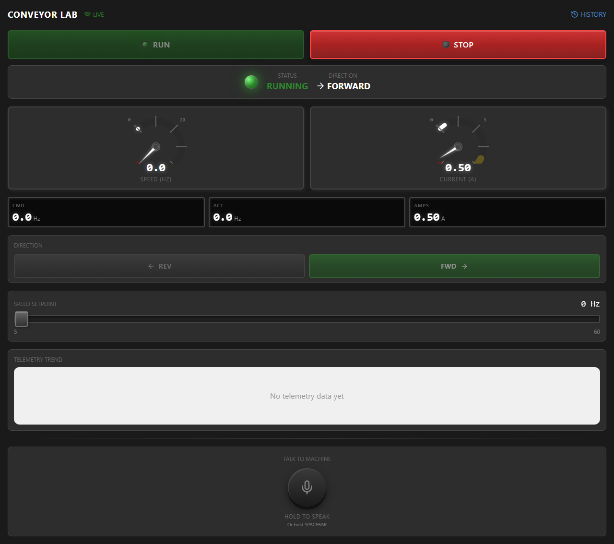

# Conveyor Lab - Industrial HMI for Factory I/O

A web-based industrial HMI (Human Machine Interface) that acts as a **second screen** for Factory I/O simulation. Control and monitor your virtual conveyor belt with an ISA-101 compliant interface.



---

## Features

- **Factory I/O Integration** - Connect to 3D factory simulation via Modbus TCP
- **ISA-101 Compliant** - Industrial "gray is good" design philosophy
- **Real-time Telemetry** - 100ms polling with WebSocket streaming
- **PTT Voice Control** - Talk to your machine with push-to-talk
- **Simulator Fallback** - Works without Factory I/O for demos/testing

---

## Quick Start

### 1. Start the Backend
```bash
cd apps/conveyor-lab/backend
npm ci
npm run dev
```
Backend starts at **http://localhost:8888**

### 2. Start the Frontend
```bash
cd apps/conveyor-lab/frontend
npm ci
npm run dev
```
Frontend starts at **http://localhost:3001**

### 3. Open the HMI
Navigate to **http://localhost:3001** in your browser.

---

## Factory I/O Setup

### Prerequisites
- **Factory I/O** (Modbus & OPC Edition) - [Download](https://factoryio.com/)
- The app auto-detects Factory I/O on startup

### Step 1: Open Factory I/O
Launch Factory I/O and open a scene with a conveyor belt:
- **File → Open → Scenes → Sorting by Height (Basic)**
- Or any scene with a Belt Conveyor

### Step 2: Configure Modbus TCP Server
1. Press **F4** to open the Driver Configuration
2. Select **Modbus TCP/IP Server** from the driver list
3. Click **Configuration**:
   - Port: `502`
   - Unit ID: `1`
4. Click **Connect**

### Step 3: Map I/O Tags
In the Driver Configuration, map these tags:

| Tag Type | Address | Factory I/O Tag |
|----------|---------|-----------------|
| Coil | 0 | Belt Conveyor (Entry) |
| Discrete Input | 0 | Belt Conveyor (Entry) - Running |

### Step 4: Start Simulation
Press **F5** or click the Play button to start the simulation.

### Step 5: Start Conveyor Lab
The backend will auto-detect Factory I/O:
```
[Modbus] Connected to Factory I/O
[Conveyor] Connected to Factory I/O via Modbus TCP
║  Conveyor:  Factory I/O                            ║
```

---

## HMI Controls

### Status Panel
| Element | Description |
|---------|-------------|
| **LIVE** indicator | Green when connected |
| **Status lamp** | Green = Running, Gray = Stopped, Red = Fault |
| **Direction** | FORWARD or REVERSE |

### Control Buttons
| Button | Action |
|--------|--------|
| **RUN** | Start the conveyor |
| **STOP** | Stop the conveyor |
| **REV** | Set direction to Reverse |
| **FWD** | Set direction to Forward |

### Gauges
| Gauge | Range | Description |
|-------|-------|-------------|
| **SPEED** | 0-60 Hz | Motor speed in Hertz |
| **CURRENT** | 0-10 A | Motor current draw |

### Numeric Displays
- **CMD** - Commanded speed (setpoint)
- **ACT** - Actual speed (feedback from Factory I/O)
- **AMPS** - Motor current

### Speed Setpoint Slider
Drag the slider to set target speed (5-60 Hz).

---

## Connection Modes

The backend automatically selects the connection mode at startup:

### Factory I/O Mode (`connectionMode: "factoryio"`)
- Connected to Factory I/O via Modbus TCP
- Live data from 3D simulation
- Controls affect the virtual factory

### Simulator Mode (`connectionMode: "simulator"`)
- Built-in VFD simulator
- Used when Factory I/O is not running
- Full functionality for testing/demos

Check the current mode:
```bash
curl http://localhost:8888/api/status | jq .connectionMode
```

---

## PTT Voice Commands (Push-to-Talk)

### How to Use
1. Click and **hold** the microphone button (or hold **SPACEBAR**)
2. Speak your command
3. Release to send

### Example Commands
| Voice Command | Action |
|---------------|--------|
| "Start the conveyor" | Starts the belt |
| "Stop" | Stops the belt |
| "Set speed to 45 Hz" | Changes speed setpoint |
| "What's the current speed?" | Reports status |
| "Why did it fault?" | Explains fault condition |

### Requirements
- Modern browser with Web Speech API support (Chrome, Edge)
- Microphone permissions granted

---

## API Reference

### GET /api/status
Returns current VFD status.
```json
{
  "runState": "running",
  "direction": "forward",
  "commandHz": 30,
  "actualHz": 29.5,
  "motorCurrent": 2.45,
  "faultCode": 0,
  "faultText": "No Fault",
  "connectionMode": "factoryio"
}
```

### POST /api/command
Send control commands.
```bash
# Start
curl -X POST http://localhost:8888/api/command \
  -H "Content-Type: application/json" \
  -d '{"action": "start"}'

# Stop
curl -X POST http://localhost:8888/api/command \
  -H "Content-Type: application/json" \
  -d '{"action": "stop"}'

# Set Speed
curl -X POST http://localhost:8888/api/command \
  -H "Content-Type: application/json" \
  -d '{"action": "set_speed", "value": 45}'

# Set Direction
curl -X POST http://localhost:8888/api/command \
  -H "Content-Type: application/json" \
  -d '{"action": "set_direction", "value": "reverse"}'
```

### WebSocket /ws/telemetry
Real-time status updates at 100ms intervals.
```javascript
const ws = new WebSocket('ws://localhost:8888/ws/telemetry');
ws.onmessage = (event) => {
  const { type, data } = JSON.parse(event.data);
  if (type === 'status') {
    console.log('Status:', data);
  }
};
```

---

## Architecture

```
┌─────────────────────────────────────────────────────────────────┐
│                    YOUR LAPTOP                                  │
├─────────────────────────────────────────────────────────────────┤
│                                                                 │
│  ┌─────────────────┐        ┌─────────────────┐                │
│  │   Factory I/O   │        │  Conveyor Lab   │                │
│  │   (3D Sim)      │◄──────►│  HMI (Browser)  │                │
│  │                 │ Modbus │                 │                │
│  │  Port 502       │  TCP   │  Port 3001      │                │
│  └────────┬────────┘        └────────┬────────┘                │
│           │                          │                          │
│           ▼                          ▼                          │
│  ┌─────────────────────────────────────────────────────────────┐│
│  │              Conveyor Lab Backend (Port 8888)               ││
│  │  ┌─────────────────────┐    ┌────────────────────────────┐ ││
│  │  │ Modbus TCP Client   │    │    WebSocket Server        │ ││
│  │  │ (reads/writes I/O)  │────│  (streams status to HMI)   │ ││
│  │  └─────────────────────┘    └────────────────────────────┘ ││
│  └─────────────────────────────────────────────────────────────┘│
│                                                                 │
└─────────────────────────────────────────────────────────────────┘
```

---

## Troubleshooting

### "Factory I/O not available, using simulator"
- Ensure Factory I/O is running
- Check Modbus TCP Server is enabled (F4 → Modbus TCP/IP Server → Connect)
- Verify the IP address in `backend/src/config/modbus-config.ts` matches your Factory I/O binding

### Connection Timeout on Commands
- Factory I/O Modbus driver may need I/O tags mapped
- Check the Coil addresses match your scene's actuators
- Increase timeout in `modbus-config.ts`

### WebSocket Not Connecting
- Ensure backend is running on port 8888
- Check browser console for CORS errors

For more setup help, see [TROUBLESHOOTING.md](TROUBLESHOOTING.md).

### Voice Recognition Not Working
- Use Chrome or Edge browser
- Grant microphone permissions when prompted
- Speak clearly after pressing the PTT button

---

## Configuration

### Environment Variables
```bash
PORT=8888                    # HTTP server port
MODBUS_HOST=100.83.251.23    # Factory I/O IP address
MODBUS_PORT=502              # Modbus TCP port
MODBUS_UNIT_ID=1             # Modbus unit ID
FACTORYIO_AUTO_CONNECT=true  # Auto-detect Factory I/O
TELEGRAM_BOT_TOKEN=          # Required for production Telegram Mini App auth
```

### Modbus Register Map
Edit `backend/src/config/modbus-config.ts` to match your Factory I/O scene:

```typescript
export const MODBUS_MAP = {
  coils: {
    CONVEYOR: 0,  // Conveyor on/off
    FORWARD: 1,   // Direction forward
    REVERSE: 2,   // Direction reverse
  },
  discreteInputs: {
    RUNNING: 0,   // Conveyor running status
  },
};
```

See [MODBUS_MAP.md](MODBUS_MAP.md) for the complete current address map.

---

## Project Docs

- [DEVELOPMENT.md](DEVELOPMENT.md) - local development and verification
- [ARCHITECTURE.md](ARCHITECTURE.md) - runtime shape and safety boundary
- [API.md](API.md) - REST and WebSocket API reference
- [MODBUS_MAP.md](MODBUS_MAP.md) - Factory I/O address mapping
- [TROUBLESHOOTING.md](TROUBLESHOOTING.md) - common setup failures
- [SECURITY.md](SECURITY.md) - secrets, auth, and hardware safety
- [ROADMAP.md](ROADMAP.md) - planned hardening and integration work
- [STYLE.md](STYLE.md) - UI, TypeScript, and docs conventions

---

## Tech Stack

**Backend:**
- Node.js + TypeScript
- Express + WebSocket (ws)
- modbus-serial (Modbus TCP client)
- Zod validation

**Frontend:**
- React + TypeScript
- Vite
- TailwindCSS (ISA-101 theme)
- Web Speech API

---

## License
MIT - Factory LM
