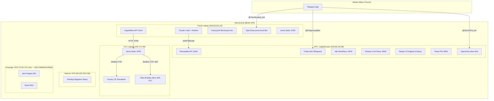
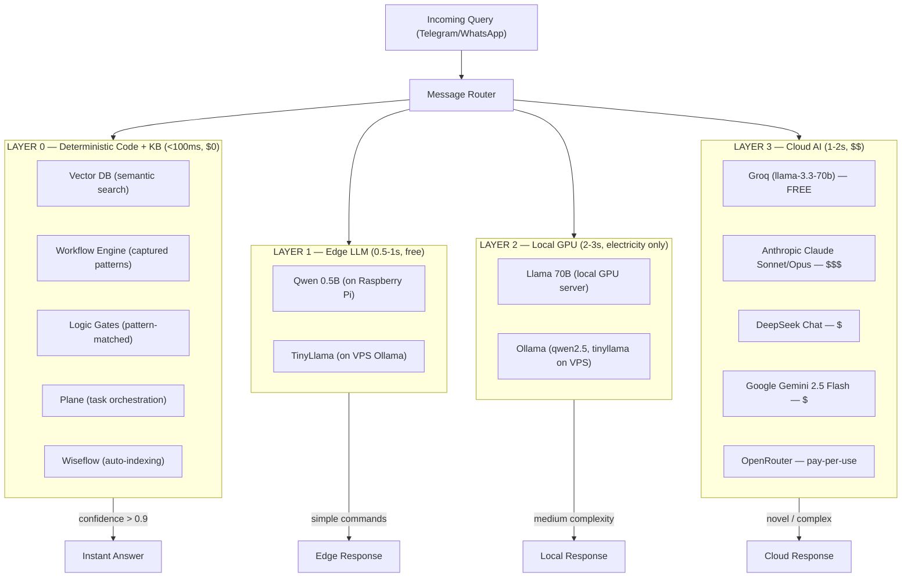
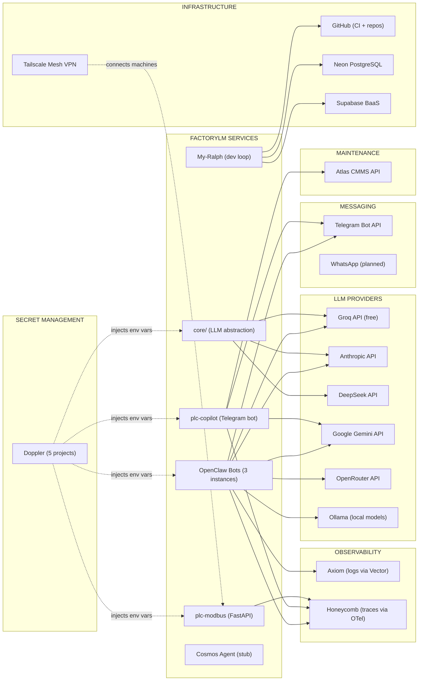
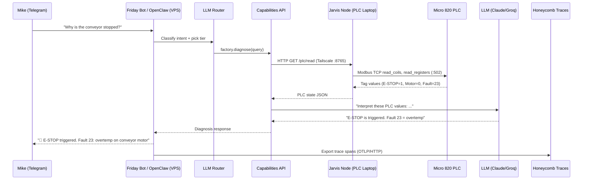
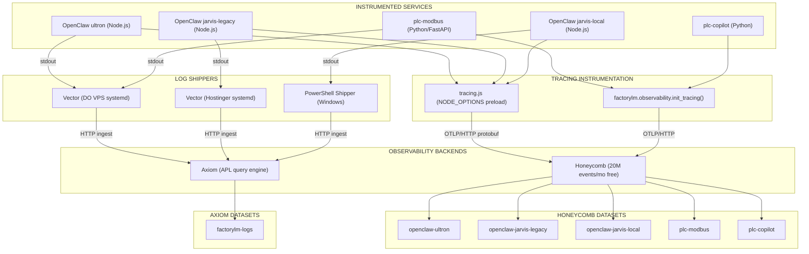
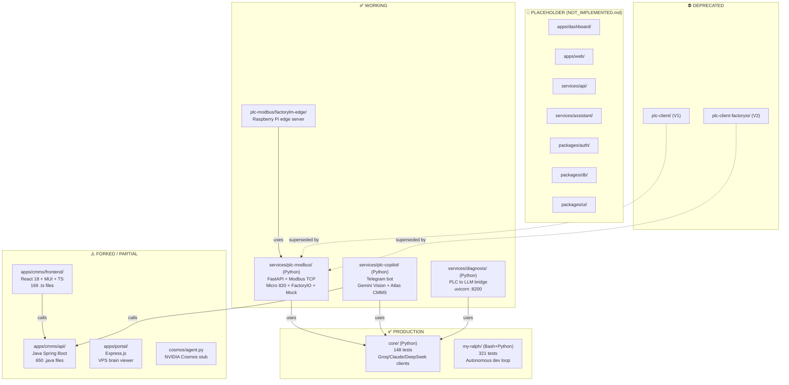
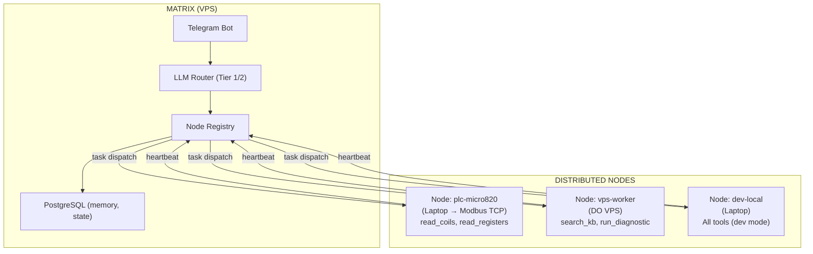

# FactoryLM — Network Maps & Resource Topology

**Generated:** 2026-02-17  
**Repo:** [github.com/Mikecranesync/factorylm](https://github.com/Mikecranesync/factorylm)

---

## 1. Physical Network & Tailscale Mesh

All machines connected via Tailscale mesh VPN.



### Machine Inventory

| Machine | Tailscale IP | Role | Key Services |
|---------|-------------|------|-------------|
| **DO VPS** | 100.68.120.99 | Production server | RemoteMe, Friday Bot, n8n, Flowise, Plane, OpenClaw ultron |
| **Travel Laptop** | 100.83.251.23 | Development | Claude Code, Antfarm, OpenClaw jarvis-local |
| **PLC Laptop** | 100.72.2.99 | Hardware interface | Factory I/O, Micro 820 PLC, Jarvis Node |
| **Hetzner VPS** | 46.225.103.156 | Migration target | Fresh — pending setup |
| **Hostinger VPS** | 72.60.175.144 | Legacy (decommissioning) | jarvis-legacy, Rivet-PRO |

---

## 2. 4-Layer Intelligence Stack & LLM Routing

Intelligence flows **downward** — the goal is LESS AI over time.



### Routing Logic (Pseudocode)

```python
def route_query(query, context):
    kb_result = knowledge_base.search(query)
    if kb_result.confidence > 0.9:
        return kb_result                    # Layer 0 — instant, free

    workflow = plane.match_workflow(query)
    if workflow:
        return workflow.execute()           # Layer 0 — instant, free

    if is_simple_command(query):
        return edge_llm.process(query)      # Layer 1 — 0.5s, free

    if gpu_server.available:
        return gpu_server.process(query)    # Layer 2 — 2-3s, electricity

    if cloud.available and not air_gapped:
        return cloud.process(query)         # Layer 3 — 1-2s, $$$
```

---

## 3. External Services & API Dependency Map



### Environment Variables by Service

| Service | Required Env Vars |
|---------|------------------|
| **core/** | `GROQ_API_KEY`, `CLAUDE_API_KEY` (opt), `DEEPSEEK_API_KEY` (opt) |
| **plc-modbus/** | `PLC_HOST`, `PLC_PORT`, `HONEYCOMB_API_KEY` (opt) |
| **plc-copilot/** | `TELEGRAM_BOT_TOKEN`, `GEMINI_API_KEY`, `CMMS_API_URL`, `CMMS_USERNAME`, `CMMS_PASSWORD` |
| **OpenClaw** | `GROQ_API_KEY`, `ANTHROPIC_API_KEY`, `HONEYCOMB_API_KEY`, `AXIOM_TOKEN` |

### Doppler Projects

| Project | Covers |
|---------|--------|
| `factorylm-core` | LLM abstraction layer |
| `factorylm-plc` | PLC Modbus service |
| `factorylm-copilot` | Telegram photo bot |
| `factorylm-infra` | Shared infra keys (Axiom, Honeycomb) |
| `openclaw` | OpenClaw bot instances |

---

## 4. PLC Data Flow — Telegram → Diagnosis → PLC

End-to-end path for a diagnostic query.



### Supported PLC Protocols

| Protocol | Devices | Status |
|----------|---------|--------|
| Modbus TCP/RTU | Universal | ✅ Working |
| EtherNet/IP | Allen-Bradley | Planned |
| Siemens S7 | S7-300/400/1200/1500 | Planned |
| OPC UA | Universal | Planned |

---

## 5. Observability Pipeline

Two systems: **Axiom** (logs) + **Honeycomb** (traces).



### Quick Health Checks

```bash
# Check tracing (plc-modbus)
curl http://localhost:8000/api/tracing-health

# Check VPS log shippers
ssh root@100.68.120.99 "systemctl status vector"

# Verify Honeycomb key
curl https://api.honeycomb.io/1/events/test \
  -H "X-Honeycomb-Team: $HONEYCOMB_API_KEY" -d '{}'
```

---

## 6. Monorepo Component Maturity Map



### Test Commands

```bash
cd core && pytest                    # 148 tests
cd my-ralph && npm test              # 321 tests
cd services/plc-modbus && pytest     # 162 tests
```

---

## 7. Voltron Architecture (PLANNED)

Distributed Matrix + Nodes system — not yet implemented.



Each node has immutable `soul.md` (identity) and `policy.yaml` (allowed tools, read-only PLC constraint).

---

*Generated from the FactoryLM monorepo — [README.md](https://github.com/Mikecranesync/factorylm/blob/main/README.md) is the canonical vision.*
